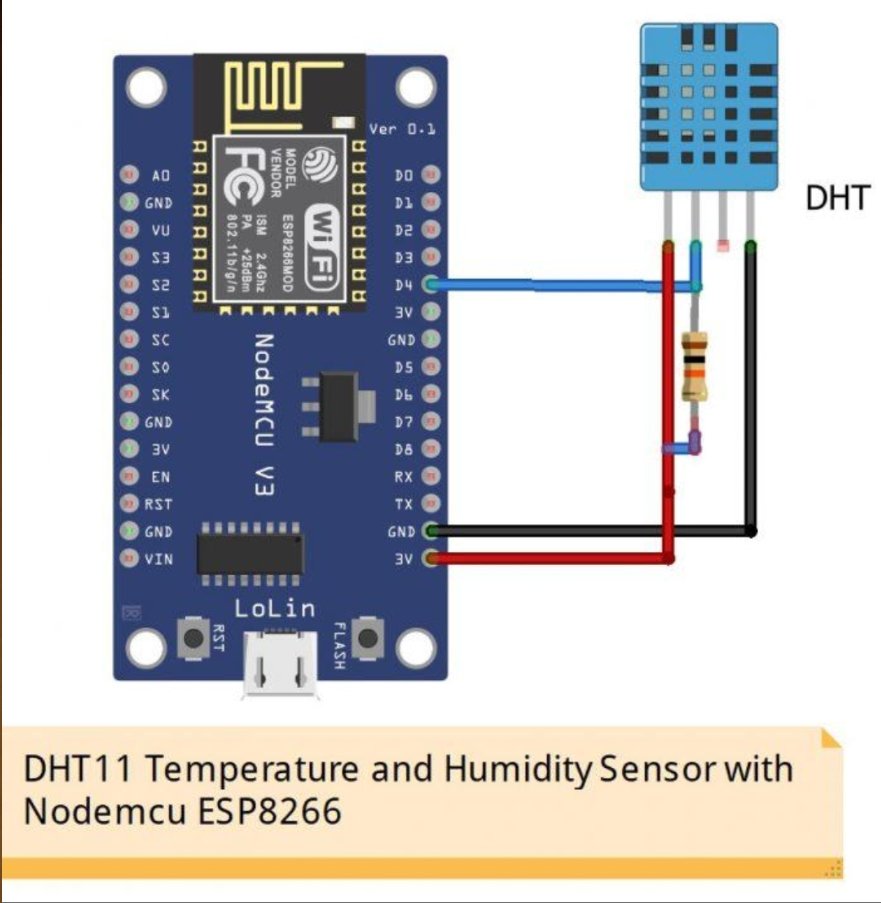
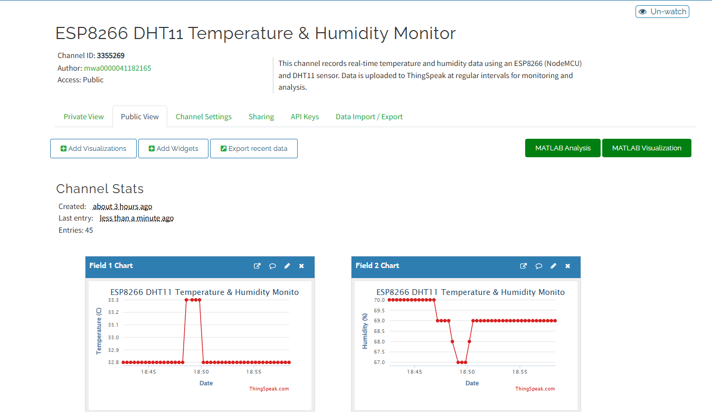
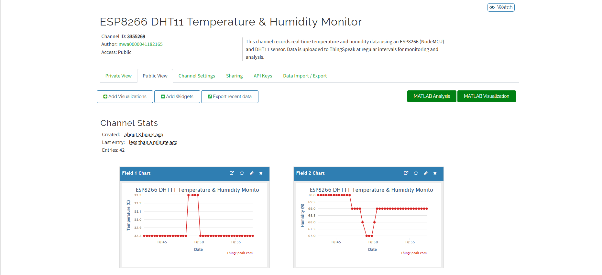

# 🌡️IoT -Based Temperature & Humidity Monitor (ESP8266)

## Overview

Reads temperature and humidity using a DHT11 sensor with ESP8266 (NodeMCU) and sends data to ThingSpeak every 15 seconds.

## Components

* ESP8266 (NodeMCU)
* DHT11 Sensor
* Jumper Wires

## Connections

* VCC → 3V
* GND → GND
* DATA → D4

## Circuit Diagram

## Output

## How to Run

1. Open Arduino IDE
2. Install ESP8266 board and DHT library
3. Add WiFi credentials and ThingSpeak API key
4. Upload code to ESP8266
5. Open Serial Monitor

## Note

Data update interval: 15 seconds.

## License

MIT License
